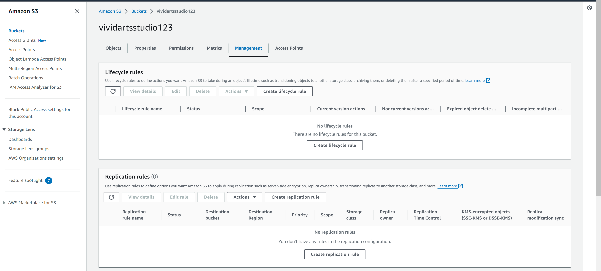
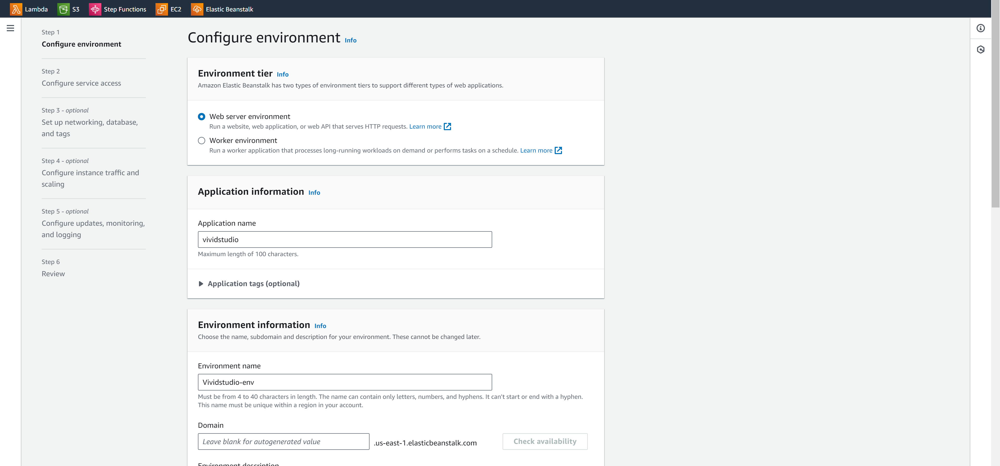
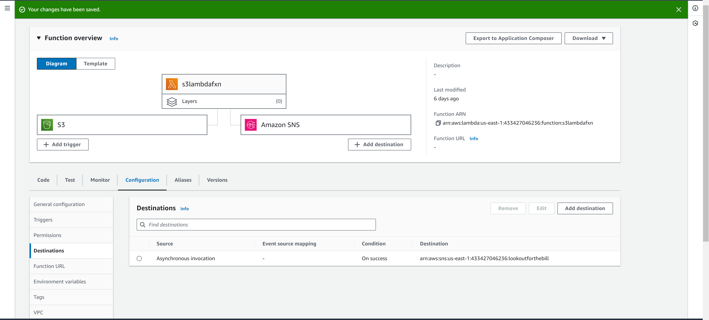
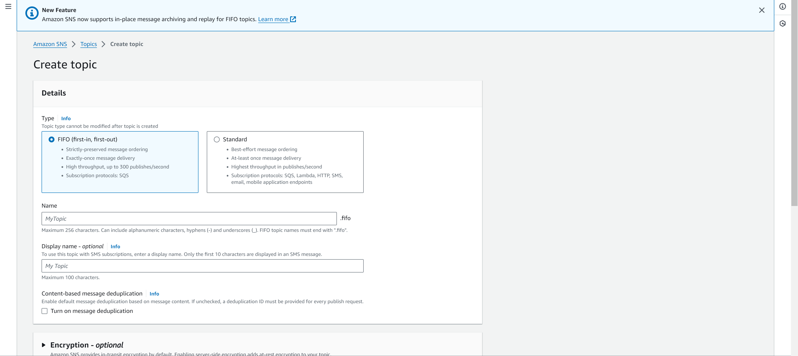
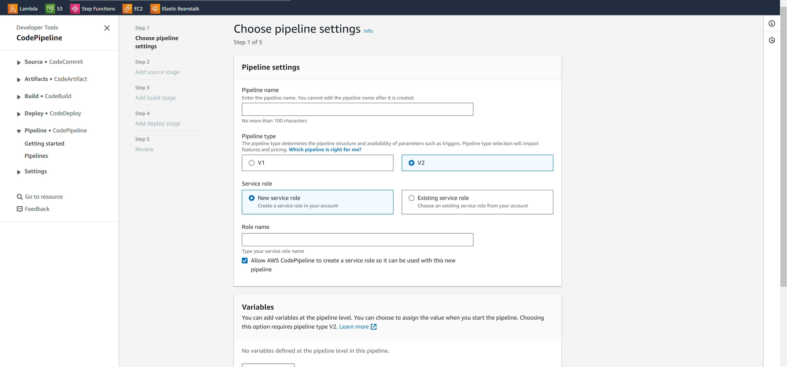

# Vivid Arts Studio

# Collaborators
 1. Anthony Kioko - https://github.com/Tonny-Kioko - https://www.linkedin.com/in/anthony-kioko-4021b01a5

 2. Brian Maiyo - https://github.com/brianmaiyo

 3. Eugene Appertey - https://github.com/UJAY-UJAY

# Project Overview

1. Containerization:
Often, it is challenging to collaborate on a project with different systems. Through containerization, project specific dependencies can be installed and collaboration is made seamless. 

2. Automated Photo Editing Workflow:
 An automated editing workflow initiated by any file uploads to s3 through a Lambda function. Editing tools will be initiated once the function is invoked. 

3. User-Friendly Interface
Once a photo is uploaded to the S3 bucket, an SNS push notification will be sent to notify the client/photographer that their image is uploaded and ready for editing. 

4. Cloud Storage for Accessibility:
Client/Photographer images will be stored in S3. This option is highly scalable and accessible and will incur the least charges. A bucket lifecycle configuration will be implemented to move images to S3 Glacier after 30 days of inactivity. After 90 days, they will be deleted. 

5. Infrastructure as Code (IaC):
The required infrastructure will  be provisioned through a terraform script. This will automate the process and make it easier to monitor deployed resources. 

6. Monitoring and Analytics:
Insights will be gathered through Cloudwatch Logs saved to S3. These will make it easier to monitor bottlenecks and problems that arise. Distributed tracing will also be achieved through AWS X-Ray when making improvements on how requests move through the website. 

7. Continuous Integration/Continuous Deployment(CI/CD):
A CI/CD pipeline will be implemented using AWS Pipeline. Each stage will require automated approvals through testing and thus a faster development cycle. 

##

# Getting Started
## Technologies Used
1. Amazon S3
2. Amazon Beanstalk
3. Lambda
4. Simple Notification Services
5. Amazon CodePipeline
6. Docker
7. Terraform

## Step One: Setting up an S3 Bucket
1. Open Amazon S3, nd click on create a bucket. 
2. Enter a unique name and within the bucket, create an "Upload/" folder. 
3. Under lifecycle management, create a retention policy to move objects to Amazon Glacier after 30 days of inactivity.

## Step Two: Creating an Elasticbeanstalk Environment
1. Open Elasticbeanstalk and select Create Application. 
2. Follow the configurations, and upload code from a local .zip file containing the code. 
3. Select Python as the preferred runtime, and ensure all configurations are correct. 
4. Once created, an Elasticbeanstalk environment will be created with a provided URL. You can access the deployed application. 

## Step Three: Setting up a Lambda Function
1. Start AWS Lambda and select create function. 
2. Configure function code to trigger on uploads to the S3 Bucket. 
3. Add the destination as Amazon SNS, and we can now configure the push notifications upon file uploads. 

## Step Four: Setting up Simple Notification Services
1. Start Amazon SNS and select Create platform application
2. Make configurations for the application, and save your changes. Additional configurations will be required, based on the push notification platform selected. 
3. Once setup, any actions from the application will be notified to the client/photographer. 

## Step Five: Creating a Code Pipeline
1. Start Amazon CodePipeline and select Create pipeline. 
2. Remember to add your source code to Amazon CodeCommit as this will be our source on the pipeline. 
3. Configure the build stage and ensure it is well configured. 
4. Finally, set up the deploy stage and ensure proper approvals are set for a smooth deployment process. 
5. With the pipeline setup, each deployment will create a new build.

## Step Six: Creating a Docker script
1. Configure a Docker script to create a container. 
2. You can find a Dockerfile at the root of the repository. 
3. Run "docker build -t vividarts_studio-1.0.0 ." to create the image. 
4. Run "Docker push" to move your image to the Docker repository, and you can also move it to Amazon ECS. 

## Step Seven: Creating an Iac Script on Terraform
1. Map all resources you will need during the deployment process. 
2. You can find a main.tf file with the deployed resources. 
3. Run 'terraform init' to initiate terraform on your local machine. 
4. Run 'terraform plan' to review the resources that will be deployed. Once sure, proceed to the next step. 
5. Finally, run 'terraform deploy --auto-approve' to launch all your resources. 

# Following Along...
This is a guide to running the project locally and replicating all the steps followed in deploying the project. Here is a simple guide to follow along;

- Clone the repository;
    git clone https://github.com/Tonny-Kioko/Vividarts_studio.git

-  Run the app.py to test that the project is running well locally. 

# Contact
 1. Anthony Kioko - https://github.com/Tonny-Kioko - https://www.linkedin.com/in/anthony-kioko-4021b01a5

 2. Brian Maiyo - https://github.com/brianmaiyo - https://www.linkedin.com/in/brianmaiyo
 3. Eugene Appertey - https://github.com/UJAY-UJAY

